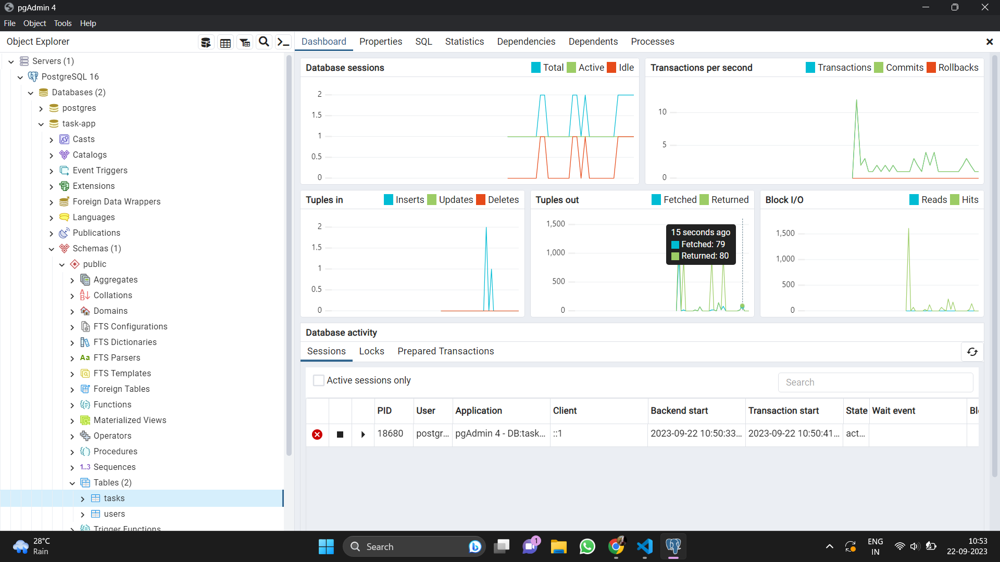

# Task App Backend

This repository contains the backend code for the Task App, a web application for managing tasks using Node.js, Express, and PostgreSQL.

## Table of Contents
- [Project Overview](#project-overview)
- [Prerequisites](#prerequisites)
- [Project Structure](#project-structure)
- [Getting Started](#getting-started)
  - [Installation](#installation)
  - [Configuration](#configuration)
- [Database Schema](#database-schema)
- [API Endpoints](#api-endpoints)
- [Contributing](#contributing)
- [License](#license)

## Project Overview
The Task App is a web application that allows users to manage tasks efficiently. It provides features for creating, updating, and deleting tasks, as well as assigning tasks to specific users. The backend of the application is built using Node.js, Express, and PostgreSQL.

## Prerequisites
Before setting up the backend, make sure you have the following prerequisites installed on your system:
- [Node.js](https://nodejs.org/): Version 14 or higher
- [PostgreSQL](https://www.postgresql.org/): Version 12 or higher

## Project Structure
The project structure is organized as follows:
task-app/
├── server.js # Main application file
├── database.js # Database connection and queries
├── package.json # Node.js dependencies and scripts
└── README.md # Project documentation (this file)

## Getting Started
Follow these steps to set up and run the Task App backend:

### Installation
1. Clone the repository:
-git clone https://github.com/your-username/task-app.git
-cd task-app

2. Install dependencies:
-npm install

### Configuration
Create a PostgreSQL database and update the database connection configuration in `database.js` with your database credentials.

## Database Schema
The database schema consists of two main tables:

1. **Tasks Table:**
- `taskid` (Primary Key): Uniquely identifies each task.
- `task_description`: Describes the task.

2. **Users Table:**
- `uid` (Primary Key): Uniquely identifies each user.
- `username`: User's name.
- `taskid` (Foreign Key): Related to the task the user is assigned to.
- `user_status`: Represents the status of the user's task.

## API Endpoints
The following API endpoints are available:

### Task Endpoints:
- `POST /api/tasks`: Create a new task.
- `GET /api/tasks`: Get all tasks.
- `GET /api/tasks/:id`: Get a task by ID.
- `PUT /api/tasks/:id`: Update a task by ID.
- `DELETE /api/tasks/:id`: Delete a task by ID.

### User Endpoints:
- `POST /api/users`: Create a new user.
- `GET /api/users`: Get all users.
- `GET /api/users/:id/tasks`: Get user's tasks by ID.
- `PUT /api/users/:id/status`: Update user's status by ID.

## Contributing
Contributions to the Task App backend are welcome! To contribute, follow these steps:
1. Fork the repository.
2. Create a new branch for your feature or bug fix.
3. Make your changes and commit them.
4. Push your changes to your fork.
5. Create a pull request to merge your changes into the main repository. Please make sure to update tests and documentation as necessary.

## License
This project is licensed under the MIT License.

## Pictures
Operations of postgresql

Task-endpoints

User-endpoints

